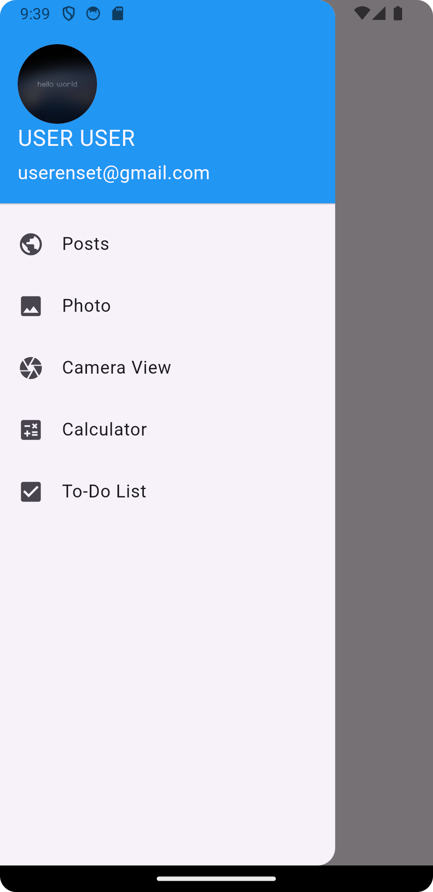
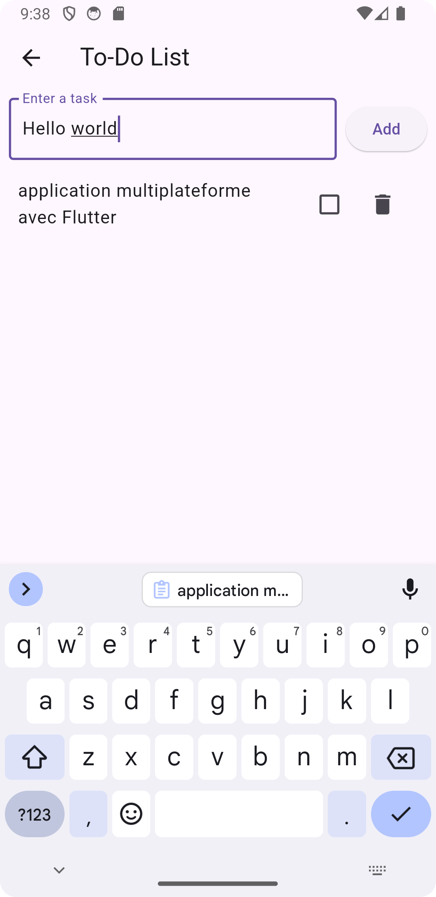

<h1>Application Multiplateforme avec Flutter</h1>

<h2>L'application est constituée de plusieurs Vues</h2>

<h2>L'objectifs sont:</h2>

<ul>
      <li>Configurer flutter frameWork</li>
      <li>Associer les Widgets</li>
      <li>Naviguer entre les Vues</li>
      <li>Accéder aux ressources externes</li>

</ul>

<h2>Screens</h2>

